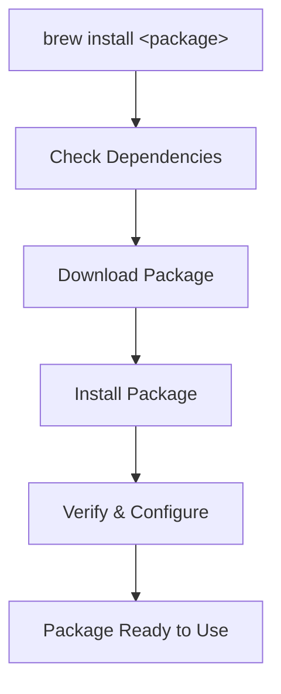

# 🐍 Homebrew: The Package Manager for macOS & Linux

Homebrew is a popular **package manager** that simplifies installing, updating, and managing software on **macOS** and **Linux** directly from the command line.

---

## 🛠 What is Homebrew?

Homebrew is a **command-line tool** that allows users to:

* Install software quickly
* Manage dependencies automatically
* Keep software up to date
* Access a wide range of packages maintained by a large community

> Think of it as a “Swiss Army knife” for installing software on your system.

---

## 📦 What is a Package Manager?

A **package manager** automates software management:

| Task                | Manual Approach                          | Package Manager Approach            |
| ------------------- | ---------------------------------------- | ----------------------------------- |
| Install software    | Download → Extract → Configure → Install | `brew install <package>`            |
| Update software     | Track versions manually                  | `brew upgrade`                      |
| Manage dependencies | Install each dependency manually         | Automatically resolves dependencies |
| Uninstall software  | Delete files manually                    | `brew uninstall <package>`          |

---

## ⚡ Installing Software with Homebrew

Installing software is simple:

```bash
brew install <package>
```

Example:

```bash
brew install git
```

> Homebrew will automatically download the correct version and all required dependencies.

---

## ⬆ Updating Software

Update all installed packages with a single command:

```bash
brew upgrade
```

To update Homebrew itself:

```bash
brew update
```

This keeps Homebrew’s **core and formulae** up-to-date.

---

## ❓ What is a Dependency?

A **dependency** is software or a library required for another program to work.

Homebrew automatically handles dependencies:

```text
Installing Node.js also installs npm as a dependency.
```

---

## 🆚 Homebrew vs Manual Installation

| Feature                  | Homebrew                          | Manual Installation                       |
| ------------------------ | --------------------------------- | ----------------------------------------- |
| Ease of use              | ✅ Very easy                       | ❌ Complex, multiple steps                 |
| Dependency management    | ✅ Automatic                       | ❌ Manual                                  |
| Updates                  | ✅ Single command (`brew upgrade`) | ❌ Individual downloads                    |
| Supported software types | ✅ CLI & some GUI apps             | ❌ Varies, may require multiple installers |

---

## 🌐 Homebrew vs Other Package Managers

| Package Manager | Language / Platform | Scope                            | Example Command        |
| --------------- | ------------------- | -------------------------------- | ---------------------- |
| Homebrew        | macOS, Linux        | System-wide, CLI & some GUI apps | `brew install wget`    |
| pip             | Python              | Python packages only             | `pip install requests` |
| npm             | Node.js             | Node packages only               | `npm install express`  |
| apt             | Linux (Debian)      | System-wide Linux packages       | `sudo apt install git` |
| yum/dnf         | Linux (RedHat)      | System-wide Linux packages       | `sudo dnf install git` |

> ✅ Homebrew is **universal and flexible**, unlike language-specific managers.

---

## 🗑 Removing Packages

Uninstalling software is just as simple:

```bash
brew uninstall <package>
```

---

## 💻 Can Homebrew Manage GUI Apps?

Yes! Using the **Homebrew Cask** extension:

```bash
brew install --cask <app_name>
```

Example:

```bash
brew install --cask google-chrome
```

> You can now manage GUI apps the same way as CLI tools.

---

## 🌟 Benefits of Using Homebrew

* Simplifies software installation & management
* Handles dependencies automatically
* Easy to update both software and Homebrew itself
* Works on macOS and Linux
* Community-driven & open source

---

## 🔧 Quick Reference Commands

| Task                      | Command                    |
| ------------------------- | -------------------------- |
| Install software          | `brew install <package>`   |
| Update all software       | `brew upgrade`             |
| Update Homebrew itself    | `brew update`              |
| Uninstall software        | `brew uninstall <package>` |
| Search for packages       | `brew search <package>`    |
| List installed packages   | `brew list`                |
| View info about a package | `brew info <package>`      |

---

## 🔄 How Homebrew Works (Mermaid Flowchart)



> This flow shows how Homebrew automatically handles **dependencies**, **downloads**, and **installation**, making software management seamless.

---

## 🔍 Summary

Homebrew is your **go-to tool** for managing software on macOS and Linux:

* Simple installation and updates
* Automatic dependency handling
* Supports both CLI and some GUI applications
* Open-source and community-maintained

> Whether you’re a developer or casual user, Homebrew makes managing software a **breeze**.
